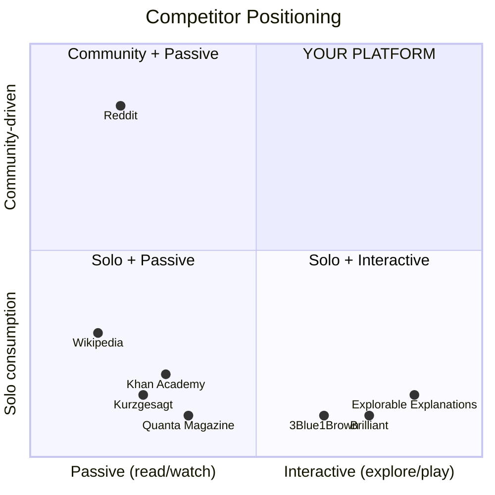

# 🧠 Nerd Website — Scope & Competitive Analysis

## The Idea in One Line

A community-driven, interactive knowledge platform that makes complex concepts (paradoxes, theories, laws, phenomena) visually explorable — a place where curiosity meets interactivity.

---

## Competitive Landscape

### Direct Competitors

| Platform | What They Do | Strengths | Gaps Your Platform Can Fill |
|---|---|---|---|
| **Brilliant.org** | Interactive STEM courses with guided problem-solving | Polished interactive lessons, gamification, strong mobile | Paywall-heavy ($25/mo). No community layer. Curriculum-focused, not exploration-focused. Feels like school. |
| **Khan Academy** | Free video + practice-based education | Massive content library, free, credentialed | Passive video format. No interactivity in explanations. No community discourse. |
| **Wikipedia** | Crowdsourced encyclopedia | Exhaustive, free, trusted | Dry text walls. Zero interactivity. No visual explanations. Anti-community. |
| **Reddit (r/explainlikeimfive, r/askscience)** | Community Q&A + discussion | Massive community, real-time discussion, diverse topics | Text-only. No curated visual explainers. Content gets buried. No structured knowledge base. |
| **Kurzgesagt (YouTube)** | Animated science explainer videos | Beautiful animations, massive audience | One-way video. No interactivity. No community beyond comments. Can't "play" with concepts. |
| **3Blue1Brown** | Math visualization videos | Stunning math animations (Manim) | Video-only. Not explorable. No community. Narrow scope (math). |
| **Explorable Explanations (explorabl.es)** | Curated list of interactive essays | Niche, beautiful, interactive | Just a directory — no original content, no community, no scale. |
| **Quanta Magazine** | Science/math journalism | Deep, well-written, some interactives | Journalism, not community. Passive reading. Limited interactivity. |

### Adjacent Competitors

| Platform | Overlap | Key Difference |
|---|---|---|
| **Stack Exchange** | Q&A community for specialized topics | Strictly Q&A format, no exploratory content |
| **Coursera / edX** | Structured learning | Course-based, certification-driven, feels academic |
| **Notion / Obsidian communities** | Knowledge bases, personal wikis | Personal tools, not social platforms |
| **Discord servers (science communities)** | Real-time nerd communities | Chat-based, ephemeral, no structured knowledge |
| **Medium / Substack** | Long-form science writing | Writer-centric, no interactivity |

---

## The Opportunity Gap

> [!IMPORTANT]
> **Nobody occupies the top-right quadrant** — interactive + community-driven. This is your blue ocean. Every competitor is either interactive but solo (Brilliant, 3Blue1Brown) or community-driven but passive (Reddit, Discord). Your concept lives in the intersection.

---

## Scope Breakdown

### Core Pillars

#### 1. 🎨 Interactive Explainers (The Hook)
Visual, playable explanations of concepts like:
- **Murphy's Law** → interactive probability simulator showing why things go wrong
- **Grandfather Paradox** → interactive timeline where users can "change" events and see cascading effects
- **Schrödinger's Cat** → quantum state visualizer
- **Butterfly Effect** → chaotic system simulator
- **Fermi Paradox** → interactive Drake equation calculator
- **Dunning-Kruger Effect** → self-assessment quiz + graph reveal

**Tech approach**: Canvas/WebGL/Three.js animations, D3.js data viz, custom interactive widgets

#### 2. 💬 Community Layer (The Stickiness)
Reddit-like discussion around each concept:
- Comments & threads on every explainer
- User-submitted "alternative explanations"
- Voting/ranking system
- "Explain it your way" — community-contributed explainers
- Topic-based forums (Physics, Philosophy, Psychology, Math, CS, etc.)

#### 3. 📚 Knowledge Graph (The Depth)
Connected concepts that users can traverse:
- Murphy's Law → links to Probability Theory → links to Gambler's Fallacy → links to Cognitive Biases
- Interactive concept map users can explore
- "Rabbit hole" mode — auto-suggest related deep dives

#### 4. 🏆 Gamification (The Retention)
- "Concepts explored" counter
- Streak system for daily learning
- Badges for completing topic trees
- Leaderboards for community contributions
- XP for creating explainers, commenting, curating

---

## Topic Universe (Content Categories)

| Category | Example Topics |
|---|---|
| **Physics & Cosmology** | Grandfather Paradox, Twin Paradox, Dark Matter, String Theory, Entropy |
| **Mathematics** | Infinity types, Gödel's Incompleteness, Chaos Theory, Golden Ratio |
| **Philosophy & Logic** | Ship of Theseus, Trolley Problem, Zeno's Paradoxes, Simulation Theory |
| **Psychology & Cognition** | Dunning-Kruger, Baader-Meinhof, Confirmation Bias, Stanford Prison Experiment |
| **Computer Science** | Halting Problem, P vs NP, Turing Machine, Neural Networks |
| **Biology & Evolution** | Selfish Gene, CRISPR, Abiogenesis, Cambrian Explosion |
| **Economics & Game Theory** | Prisoner's Dilemma, Tragedy of the Commons, Nash Equilibrium |
| **History & Sociology** | Great Filter, Sapiens-level narratives, Murphy's Law origins |

---

## SWOT Analysis

### ✅ Strengths
- **Unique positioning**: No one combines interactive explainers + community
- **Viral potential**: Interactive visuals are inherently shareable
- **Infinite content**: Every concept in human knowledge is a potential page
- **Passionate audience**: Nerds are the internet's most engaged demographic
- **Low barrier**: Free content builds audience fast

### ⚠️ Weaknesses
- **Content creation is expensive**: Each interactive explainer requires design + dev work
- **Cold start problem**: Community needs critical mass to be valuable
- **Quality control**: User-generated content needs moderation
- **Monetization complexity**: Nerds resist ads and paywalls

### 🚀 Opportunities
- **AI-assisted content generation**: Use AI to draft explainers, users refine
- **Creator economy**: Let community members build and monetize explainers
- **Education partnerships**: Schools/universities could adopt as supplementary tool
- **API/embed model**: Let other sites embed your interactive widgets
- **Mobile app**: Interactive explainers work beautifully on touch devices

### 🔴 Threats
- **Reddit/Discord stickiness**: Hard to pull nerds away from existing communities
- **AI chatbots (ChatGPT, Gemini)**: Can explain any concept on demand
- **Brilliant's expansion**: If they add community features, overlap grows
- **Burnout**: Interactive content is 10x harder to produce than articles

---

## Recommended MVP Scope

> [!TIP]
> Start narrow, go deep. Don't try to cover everything — own one category first.

### Phase 1 — Launch (Weeks 1-4)
- **5-10 stunning interactive explainers** (hand-crafted, flagship quality)
  - Murphy's Law, Grandfather Paradox, Schrödinger's Cat, Trolley Problem, Prisoner's Dilemma
- **Beautiful landing page** with concept browser
- **Individual concept pages** with interactive visuals + written explanation
- **Basic community**: comments on each explainer
- **Concept connections**: "Related concepts" sidebar

### Phase 2 — Community (Weeks 5-8)
- User accounts & profiles
- Upvote/downvote on comments
- "Suggest an explanation" feature
- Topic categories & browsing
- Share/embed functionality

### Phase 3 — Scale (Weeks 9-12)
- Knowledge graph visualization
- User-submitted explainers (with approval flow)
- Gamification (XP, badges, streaks)
- Search & discovery
- Mobile optimization

---

## Revenue Model Options

| Model | Fit | Notes |
|---|---|---|
| **Freemium** | ⭐⭐⭐⭐ | Free core content, premium deep-dives or "creator tools" |
| **Sponsorships** | ⭐⭐⭐⭐ | Science brands (Brilliant, Curiosity Stream) would sponsor |
| **Donations/Patreon** | ⭐⭐⭐ | Works for niche passionate audiences |
| **Education B2B** | ⭐⭐⭐⭐⭐ | License interactive modules to schools |
| **Merch** | ⭐⭐ | Nerd merch (concept art posters, etc.) |
| **Ads** | ⭐⭐ | Works at scale but hurts premium feel |

---

## Verdict

> [!IMPORTANT]
> ### This idea is strong. Here's why:
> 1. **Clear gap in the market** — nobody is doing interactive + community well
> 2. **Passionate niche** — nerds are loyal, vocal, and share obsessively
> 3. **Viral mechanics built-in** — interactive visuals get shared on social media
> 4. **Defensible moat** — quality interactive explainers are hard to replicate
> 5. **Infinite TAM** — every concept ever conceived is a potential piece of content
>
> The biggest risk is **content velocity** — each interactive explainer is a mini-project. Solve that (with AI, templates, community creation tools) and this scales.

---

## Next Steps

Ready to build? I'd suggest we start with:
1. **Design the landing page** — first impressions matter for a "nerd brand"
2. **Build 2-3 flagship interactive explainers** — Murphy's Law & Grandfather Paradox
3. **Ship the concept browser** — a beautiful way to discover topics
4. **Add basic community features** — comments, reactions

Let me know if you want to proceed with building the MVP! 🚀
